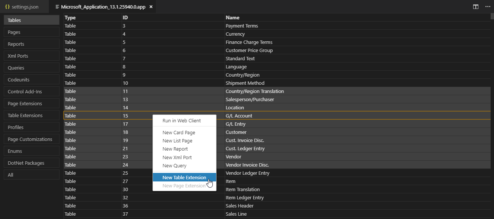

# AL Code Outline for Visual Studio Code

## Features

The AL Code Outline extension displays code outline of active file in the explorer pane. It was initially created to support AL files only, but AL project can also contain other file types for data (xml, json) and client add-ins (javascript, css, html, handlebars) so symbols tree works for them too. Basic functionality allows user to click on one of symbols tree nodes to move cursor to that symbol in the code editor. 

For AL file types, extension tries to extract a bit more information from the language server and can display context menu with additional options for some of the symbols. At this moment, context menu allows user to run pages, reports and tables in the web client and to create new card and list pages, reports, xmlports and queries with all fields from selected table symbols.

It is also possible to view symbols from symbol reference packages. Extension adds a new "Open in AL Object Browser" entry to explorer contect menu for *.app files. It opens a view that looks similar to c/al object designer. Selecting object entry in this view updates code outline view. It can also display context menu with options to show object definition and run table based object generators. Right click on object list column header opens another context menu (added by rvanbekkum), which allows to apply filter to the list.

It is also possible to select multiple rows in AL Object Browser by clicking on the lines with Ctrl or Shift keys pressed or by pressing Ctrl+A (another great rvanbekkum contribution). When multiple rows are selected, object generators will generate new files for all of them.

## Contributors

- rvanbekkum: 
  * "New Page Extension" and "New Table Extension" options in AL Object Browser
  * Ability to save generated objects in files inside project folder

## Inspiration

This extension has been inspired by "Code Outline" extension created by Patryk Zawadzki and "Tree Data Provider" example from "VS Code Extension Examples". I've decided to create it because I wanted something that could understand AL object structure and to be able to add some AL specific commands to tree nodes in the future. 

## Settings

This extension contributes the following settings:

* `alOutline.enableFeaturePreview`: enable preview of future, unstable features
* `alOutline.autorefresh`: refresh code outline tree automatically
* `alOutline.autoGenerateFiles`: automatically generate files for newly created objects
* `alOutline.autoGenerateFileDirectory`: the default directory to create files in, relative to the root directory (e.g., \"Source\<ObjectType\>\")
* `alOutline.autoShowFiles`: automatically show any newly created files in the editor
* `alOutline.defaultAppArea`: default application area for page code generator
* `alOutline.defaultListUsageCategory`: default usage category for list pages
* `alOutline.promptForObjectId`: when generating a new object, ask the user to input the object ID.
* `alOutline.promptForObjectName`: when generating a new object, ask the user to input the object name
* `alOutline.promptForFilePath`: when generating a new file, ask the user to specify a path relative to the root of the project-folder
* `alOutline.stripNonAlphanumericCharactersFromObjectNames`: always strip non-alphanumeric characters from generated object names
* `alOutline.webClientPort`: web client port number, use 0 for default http/https ports

## Known Issues

- When AL project is opened in Visual Studio Code, AL Code Outline pane might not be visible or might be empty even if one of *.al files is opened. You have to switch to another al file to display/refresh it.
- It takes some time to parse all *.al files when new project is opened so code outline will stay empty during that time. You can use Refresh button to force it to reload content. 
- Extension uses CRS-AL-LANGUAGE-EXTENSION for generating file names for new objects. As a result you will see plenty of new snippets added by the CRS extension. If you don't want to see them, go to Visual Studio settings and disable them in CRS-AL-LANGUAGE-EXTENSION section.

## About me

I'm .net and Dynamics Nav developer that moved from .net world to Dynamics Nav world in 2004. I've been using these 2 technologies since that year and currently I work as a Product Developer at The NAV People - the UK's number one reseller focused solely on Dynamics NAV thanks to its mission to provide a high level of expertise, amazing product innovation and the absolute best standard of customer service. The NAV People is truly unique in the world of NAV, check out our story here: https://thenavpeople.com/our-story 