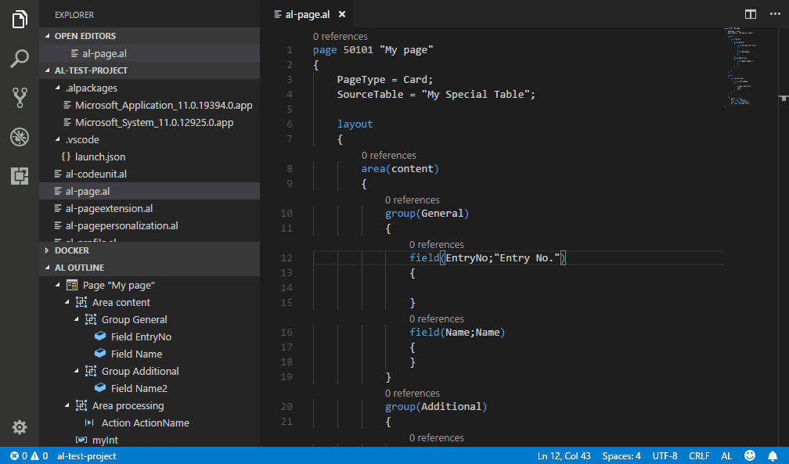
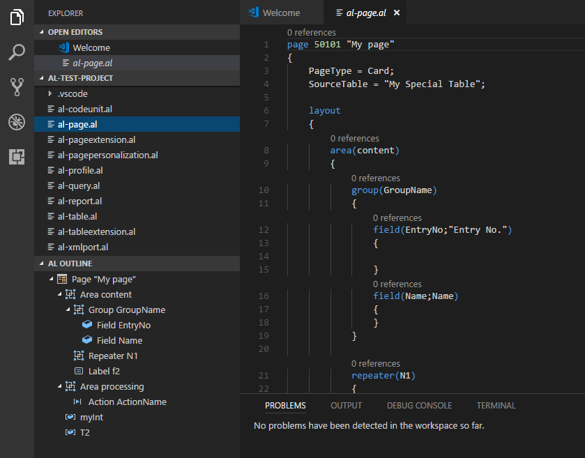

# AL Code Outline for Visual Studio Code

## Features

The AL Code Outline extension displays code outline of active file in the explorer pane. It was initially created to support AL files only, but AL project can also contain other file types for data (xml, json) and client add-ins (javascript, css, html, handlebars) so symbols tree works for them too. Basic functionality allows user to click on one of symbols tree nodes to move cursor to that symbol in the code editor. 

For AL file types, extension tries to extract a bit more information from the language server and can display context menu with additional options for some of the symbols. At this moment, context menu works for 'Table' symbol only and allows user to create new card and list pages, reports, xmlports and queries with all fields from selected table.

It is also possible to view symbols from symbol reference packages. Extension adds a new "Open in AL Object Browser" entry to explorer contect menu for *.app files. It opens a view that looks similar to c/al object designer. Selecting object entry in this view updates code outline view. It can also display context menu with options to show object definition and run table based object generators.   

## Inspiration

This extension has been inspired by "Code Outline" extension created by Patryk Zawadzki and "Tree Data Provider" example from "VS Code Extension Examples". I've decided to create it because I wanted something that could understand AL object structure and to be able to add some AL specific commands to tree nodes in the future. 

## Settings

This extension contributes the following settings:

* `alOutline.autorefresh`: refresh code outline tree automatically
* `alOutline.defaultAppArea`: default application area for page code generator
* `alOutline.defaultListUsageCategory`: default usage category for list pages

## Known Issues

- When AL project is opened in Visual Studio Code, AL Code Outline pane might not be visible even if one of *.al files is opened. You have to switch to another al file to display it.
- It takes some time to parse all *.al files when new project is opened so code outline will stay empty during that time. You can use Refresh button to force it to reload content. 

